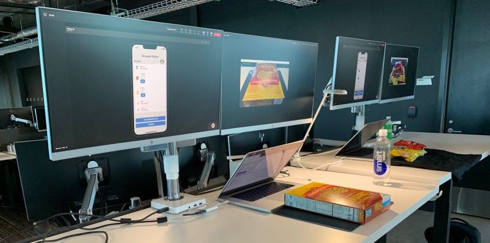
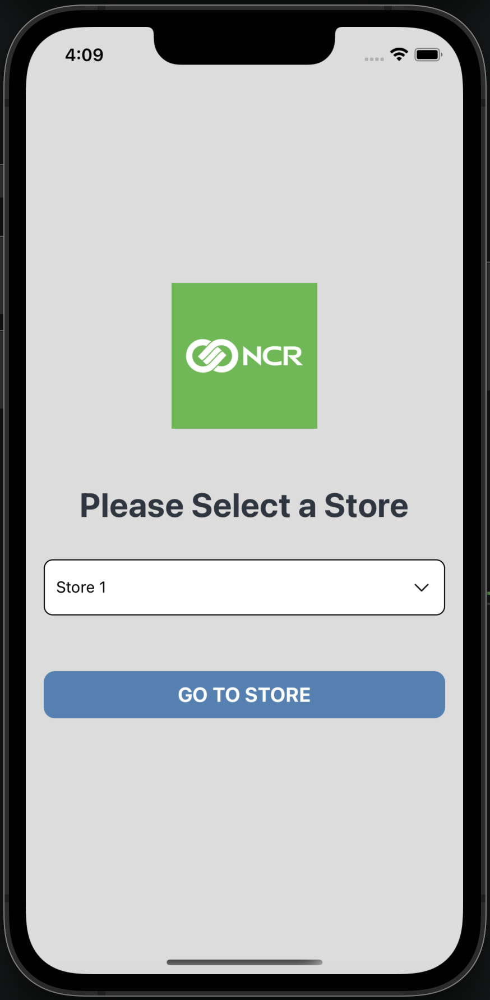
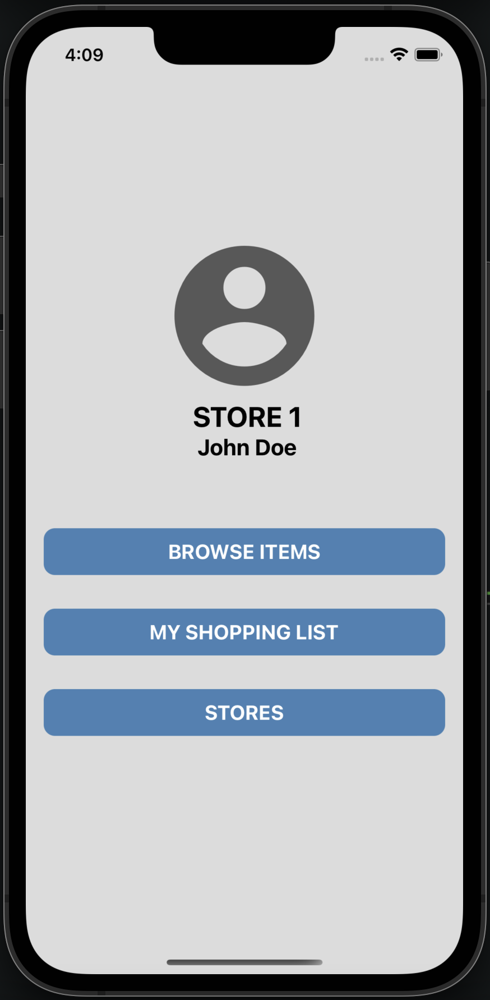
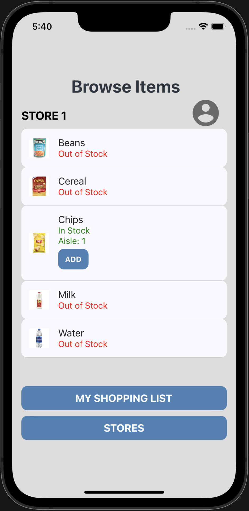
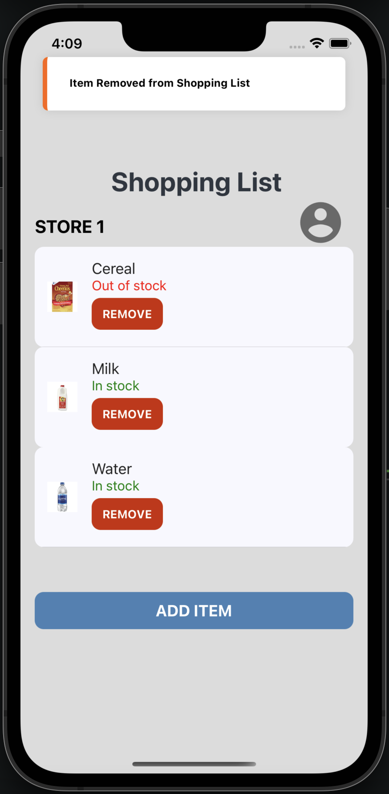

# NCR Go

## Project Summary
Our project is a mobile application solution for shopping providing customers with information on product availability and in-store location. 
Users can select their store, browse the available products, and make shopping lists through our app. The application uses cameras in the stores 
to detect the products.

  

 

  
  
  
  

## Problem: What problem are you addressing with your project?
No one likes when they go to a store with a their shopping list, but then see that products are out of stock. Some stores have inventory information available on their websites for customers, but their solutions are restricted to the specific company’s stores and rely on transaction data, which is prone to human error and fails to account for out of stock items that have not been checked out yet. So, a method to detect when items are out of stock in aisles and inform customers before physically being in the store would make the shopping experience more efficient and enjoyable. 

## Solution: How does your project solve the problem described above?
Our team has designed an app to notify users when products on their shopping list are out of stock using computer vision technology. The main components are camera functionality for product detection, a mobile app to view store products and make shopping lists, and a database to store shopping data. We created a computer vision model with the Microsoft Azure Computer Vision Toolkit which is composed of a pretrained deep convolutional neural network fine-tuned on the Freiburg Groceries Dataset. Stores can have cameras pointing at their shelves or aisles that show the products available. This camera data is then sent to our model which classifies what products are in each frame, sending the information to our app in real-time. The app allows users to select a store they want to shop at and make a shopping list based on the inventory data. The products listed as “in stock” or “out of stock” depending on whether our model detects the products or not. If a previously in stock product in a user’s shopping list becomes out of stock, the app sends a notification to the user informing them that their product is no longer available, allowing the user to go to a different store or shop for similar items. The inventory, shopping lists, and user information are stored in a MongoDB cluster, allowing our app to retrieve the data and see who should receive notifications.

## Value: How does your project provide value to NCR and its customers?
NCR can utilize our project to provide an end-to-end experience for our customers’ shoppers. Instead of each store having to design their own inventory technology for customers, NCR can provide a single solution to make the shopping experience easier. This opens a new generalized system for NCR to market to new and existing customers. Furthermore, our project has opportunities for expansion. First, we can include geolocation features to let users see stores closest to them, and when a product in their chosen store goes out of stock, we can recommend closest stores that have that product or the entire shopping list in stock. Secondly, since inventory, shopping lists, and user information are stored in a MongoDB cluster, NCR can have easy access to shopping data. This allows for lots of training data for a recommendation system, so users can be recommended similar products when an item goes out of stock. More shopping data allows for better analytics as well. Lastly, this project allows NCR to establish itself as the lead provider for stores in shopping technologies. NCR customers can improve their business by using our project to advertise easier shopping experiences, and shoppers will go through our technology anytime they need to go to the store. Finally, our project promotes many of the enumerated NCR values. First, customers can benefit from our product by improving the experience of their shoppers and reducing costs of their inventory technology. Secondly, users have more fun when shopping by making the experience more efficient. Thirdly, our project innovates inventory technology by improving upon transactional data approaches through computer vision technologies. Finally, users feel more respected in their time as they know ahead of time if they can actually buy the products they need. Hence, our project provides value to NCR and its customers by providing better experiences to users, opening up new areas of business, allowing for expansion opportunities, and promoting NCR’s values. 

